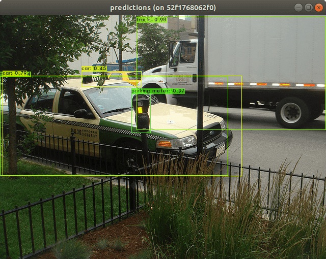

# Darknet Build on Ubuntu 18

> Host: Ubuntu 18.04

## Preparation

### Nvidia Driver

```bash
sudo add-apt-repository ppa:graphics-drivers/ppa
sudo apt update

ubuntu-drivers devices

apt-cache search nvidia | grep ^nvidia-driver
sudo apt install nvidia-driver-440

sudo reboot
```

```bash
nvidia-smi
```

### Nvidia CUDA Toolkit

> [CUDA Toolkit Archive](https://developer.nvidia.com/cuda-toolkit-archive)

```bash
$ wget http://developer.download.nvidia.com/compute/cuda/10.2/Prod/local_installers/cuda_10.2.89_440.33.01_linux.run
$ sudo sh cuda_10.2.89_440.33.01_linux.run
===========
= Summary =
===========

Driver:   Not Selected
Toolkit:  Installed in /usr/local/cuda-10.2/
Samples:  Installed in /home/john/cuda-10.2/, but missing recommended libraries

Please make sure that
 -   PATH includes /usr/local/cuda-10.2/bin
 -   LD_LIBRARY_PATH includes /usr/local/cuda-10.2/lib64, or, add /usr/local/cuda-10.2/lib64 to /etc/ld.so.conf and run ldconfig as root

To uninstall the CUDA Toolkit, run cuda-uninstaller in /usr/local/cuda-10.2/bin

Please see CUDA_Installation_Guide_Linux.pdf in /usr/local/cuda-10.2/doc/pdf for detailed information on setting up CUDA.
***WARNING: Incomplete installation! This installation did not install the CUDA Driver. A driver of version at least 440.00 is required for CUDA 10.2 functionality to work.
To install the driver using this installer, run the following command, replacing <CudaInstaller> with the name of this run file:
    sudo <CudaInstaller>.run --silent --driver

Logfile is /var/log/cuda-installer.log
```

```bash
$ vi ~/.bashrc
export CUDA_HOME=/usr/local/cuda
export PATH=$CUDA_HOME/bin:$PATH
export LD_LIBRARY_PATH=$CUDA_HOME/lib64:$LD_LIBRARY_PATH
```

```bash
$ nvcc --version
nvcc: NVIDIA (R) Cuda compiler driver
Copyright (c) 2005-2019 NVIDIA Corporation
Built on Wed_Oct_23_19:24:38_PDT_2019
Cuda compilation tools, release 10.2, V10.2.89
```

### Nvida cuDNN

> [cuDNN Download](https://developer.nvidia.com/rdp/cudnn-download)

```bash
sudo apt install ./libcudnn8_8.0.2.39-1+cuda10.2_amd64.deb
sudo apt install ./libcudnn8-dev_8.0.2.39-1+cuda10.2_amd64.deb
sudo apt install ./libcudnn8-doc_8.0.2.39-1+cuda10.2_amd64.deb

dpkg -c libcudnn8_8.0.2.39-1+cuda10.2_amd64.deb
```

### CMake

```bash
curl -O -L https://github.com/Kitware/CMake/releases/download/v3.18.2/cmake-3.18.2-Linux-x86_64.sh
sh cmake-*.sh --prefix=$HOME/Applications/
```

```bash
$ vi ~/.bashrc
export PATH=$HOME/Applications/cmake-3.18.2-Linux-x86_64/bin:$PATH
```

### Python

```bash
# https://www.anaconda.com/distribution/
bash Anaconda3-2019.10-Linux-x86_64.sh
```

## Build

### OpenCV

```bash
conda deactivate

# export CONDA_HOME="/home/john/anaconda3/envs/clenv"
export CONDA_HOME=`conda info -s | grep -Po "sys.prefix:\s*\K[/\w]*"`

cd ~/Codes/star/

git clone -b 4.4.0 --depth 1 https://github.com/opencv/opencv.git
git clone -b 4.4.0 --depth 1 https://github.com/opencv/opencv_contrib.git

cd opencv/
mkdir _build && cd _build/

cmake -DCMAKE_BUILD_TYPE=Release \
-DCMAKE_INSTALL_PREFIX=$HOME/opencv-cuda-4.4.0 \
-DOPENCV_EXTRA_MODULES_PATH=$HOME/Codes/star/opencv_contrib/modules \
\
-DPYTHON_EXECUTABLE=$CONDA_HOME/bin/python3.7 \
-DPYTHON3_EXECUTABLE=$CONDA_HOME/bin/python3.7 \
-DPYTHON3_LIBRARY=$CONDA_HOME/lib/libpython3.7m.so \
-DPYTHON3_INCLUDE_DIR=$CONDA_HOME/include/python3.7m \
-DPYTHON3_NUMPY_INCLUDE_DIRS=$CONDA_HOME/lib/python3.7/site-packages/numpy/core/include \
-DBUILD_opencv_python2=OFF \
-DBUILD_opencv_python3=ON \
\
-DWITH_CUDA=ON \
\
-DBUILD_DOCS=OFF \
-DBUILD_EXAMPLES=OFF \
-DBUILD_TESTS=OFF \
..

make -j$(nproc)
make install
```

```bash
conda activate

export LD_LIBRARY_PATH=$HOME/opencv-cuda-4.4.0/lib:$LD_LIBRARY_PATH
export PYTHONPATH=$HOME/opencv-cuda-4.4.0/lib/python3.7/site-packages:$PYTHONPATH

python - <<EOF
import cv2
print(cv2.__version__)
EOF
```

#### Issue: libfontconfig.so.1

```bash
Traceback (most recent call last):
  File "<stdin>", line 1, in <module>
  File "/home/john/opencv-cuda-4.4.0/lib/python3.7/site-packages/cv2/__init__.py", line 96, in <module>
    bootstrap()
  File "/home/john/opencv-cuda-4.4.0/lib/python3.7/site-packages/cv2/__init__.py", line 86, in bootstrap
    import cv2
ImportError: /home/john/anaconda3/bin/../lib/libfontconfig.so.1: undefined symbol: FT_Done_MM_Var
```

Solution:

```bash
cd $HOME/anaconda3/lib/
mv libfontconfig.so.1 libfontconfig.so.1.bak
ln -s /usr/lib/x86_64-linux-gnu/libfontconfig.so.1 libfontconfig.so.1
```

#### Issue: libpangoft2-1.0.so.0

```bash
ImportError: /home/john/anaconda3/bin/../lib/libpangoft2-1.0.so.0: undefined symbol: FcWeightToOpenTypeDouble
```

Solution:

```bash
cd $HOME/anaconda3/lib/
mv libpangoft2-1.0.so.0 libpangoft2-1.0.so.0.bak
ln -s /usr/lib/x86_64-linux-gnu/libpangoft2-1.0.so.0 libpangoft2-1.0.so.0
```

#### Build Information

```bash
-- General configuration for OpenCV 4.4.0 =====================================
--   Version control:               4.4.0
--
--   Extra modules:
--     Location (extra):            /home/john/Codes/star/opencv_contrib/modules
--     Version control (extra):     4.4.0
--
--   Platform:
--     Timestamp:                   2020-08-22T16:43:48Z
--     Host:                        Linux 5.4.0-42-generic x86_64
--     CMake:                       3.18.2
--     CMake generator:             Unix Makefiles
--     CMake build tool:            /usr/bin/make
--     Configuration:               Release
--
--   CPU/HW features:
--     Baseline:                    SSE SSE2 SSE3
--       requested:                 SSE3
--     Dispatched code generation:  SSE4_1 SSE4_2 FP16 AVX AVX2 AVX512_SKX
--       requested:                 SSE4_1 SSE4_2 AVX FP16 AVX2 AVX512_SKX
--       SSE4_1 (15 files):         + SSSE3 SSE4_1
--       SSE4_2 (1 files):          + SSSE3 SSE4_1 POPCNT SSE4_2
--       FP16 (0 files):            + SSSE3 SSE4_1 POPCNT SSE4_2 FP16 AVX
--       AVX (4 files):             + SSSE3 SSE4_1 POPCNT SSE4_2 AVX
--       AVX2 (29 files):           + SSSE3 SSE4_1 POPCNT SSE4_2 FP16 FMA3 AVX AVX2
--       AVX512_SKX (4 files):      + SSSE3 SSE4_1 POPCNT SSE4_2 FP16 FMA3 AVX AVX2 AVX_512F AVX512_COMMON AVX512_SKX
--
--   C/C++:
--     Built as dynamic libs?:      YES
--     C++ standard:                11
--     C++ Compiler:                /usr/bin/c++  (ver 7.5.0)
--     C++ flags (Release):         -fsigned-char -W -Wall -Werror=return-type -Werror=non-virtual-dtor -Werror=address -Werror=sequence-point -Wformat -Werror=format-security -Wmissing-declarations -Wundef -Winit-self -Wpointer-arith -Wshadow -Wsign-promo -Wuninitialized -Winit-self -Wsuggest-override -Wno-delete-non-virtual-dtor -Wno-comment -Wimplicit-fallthrough=3 -Wno-strict-overflow -fdiagnostics-show-option -Wno-long-long -pthread -fomit-frame-pointer -ffunction-sections -fdata-sections  -msse -msse2 -msse3 -fvisibility=hidden -fvisibility-inlines-hidden -O3 -DNDEBUG  -DNDEBUG
--     C++ flags (Debug):           -fsigned-char -W -Wall -Werror=return-type -Werror=non-virtual-dtor -Werror=address -Werror=sequence-point -Wformat -Werror=format-security -Wmissing-declarations -Wundef -Winit-self -Wpointer-arith -Wshadow -Wsign-promo -Wuninitialized -Winit-self -Wsuggest-override -Wno-delete-non-virtual-dtor -Wno-comment -Wimplicit-fallthrough=3 -Wno-strict-overflow -fdiagnostics-show-option -Wno-long-long -pthread -fomit-frame-pointer -ffunction-sections -fdata-sections  -msse -msse2 -msse3 -fvisibility=hidden -fvisibility-inlines-hidden -g  -O0 -DDEBUG -D_DEBUG
--     C Compiler:                  /usr/bin/cc
--     C flags (Release):           -fsigned-char -W -Wall -Werror=return-type -Werror=address -Werror=sequence-point -Wformat -Werror=format-security -Wmissing-declarations -Wmissing-prototypes -Wstrict-prototypes -Wundef -Winit-self -Wpointer-arith -Wshadow -Wuninitialized -Winit-self -Wno-comment -Wimplicit-fallthrough=3 -Wno-strict-overflow -fdiagnostics-show-option -Wno-long-long -pthread -fomit-frame-pointer -ffunction-sections -fdata-sections  -msse -msse2 -msse3 -fvisibility=hidden -O3 -DNDEBUG  -DNDEBUG
--     C flags (Debug):             -fsigned-char -W -Wall -Werror=return-type -Werror=address -Werror=sequence-point -Wformat -Werror=format-security -Wmissing-declarations -Wmissing-prototypes -Wstrict-prototypes -Wundef -Winit-self -Wpointer-arith -Wshadow -Wuninitialized -Winit-self -Wno-comment -Wimplicit-fallthrough=3 -Wno-strict-overflow -fdiagnostics-show-option -Wno-long-long -pthread -fomit-frame-pointer -ffunction-sections -fdata-sections  -msse -msse2 -msse3 -fvisibility=hidden -g  -O0 -DDEBUG -D_DEBUG
--     Linker flags (Release):      -Wl,--exclude-libs,libippicv.a -Wl,--exclude-libs,libippiw.a   -Wl,--gc-sections -Wl,--as-needed
--     Linker flags (Debug):        -Wl,--exclude-libs,libippicv.a -Wl,--exclude-libs,libippiw.a   -Wl,--gc-sections -Wl,--as-needed
--     ccache:                      NO
--     Precompiled headers:         NO
--     Extra dependencies:          m pthread cudart_static dl rt nppc nppial nppicc nppicom nppidei nppif nppig nppim nppist nppisu nppitc npps cublas cudnn cufft -L/usr/local/cuda/lib64 -L/usr/lib/x86_64-linux-gnu
--     3rdparty dependencies:
--
--   OpenCV modules:
--     To be built:                 aruco bgsegm bioinspired calib3d ccalib core cudaarithm cudabgsegm cudacodec cudafeatures2d cudafilters cudaimgproc cudalegacy cudaobjdetect cudaoptflow cudastereo cudawarping cudev datasets dnn dnn_objdetect dnn_superres dpm face features2d flann freetype fuzzy gapi hfs highgui img_hash imgcodecs imgproc intensity_transform line_descriptor ml objdetect optflow phase_unwrapping photo plot python3 quality rapid reg rgbd saliency shape stereo stitching structured_light superres surface_matching text tracking ts video videoio videostab xfeatures2d ximgproc xobjdetect xphoto
--     Disabled:                    world
--     Disabled by dependency:      -
--     Unavailable:                 alphamat cnn_3dobj cvv hdf java js julia matlab ovis python2 sfm viz
--     Applications:                perf_tests apps
--     Documentation:               NO
--     Non-free algorithms:         NO
--
--   GUI:
--     GTK+:                        YES (ver 3.22.30)
--       GThread :                  YES (ver 2.56.4)
--       GtkGlExt:                  NO
--     VTK support:                 NO
--
--   Media I/O:
--     ZLib:                        /usr/lib/x86_64-linux-gnu/libz.so (ver 1.2.11)
--     JPEG:                        libjpeg-turbo (ver 2.0.5-62)
--     WEBP:                        build (ver encoder: 0x020f)
--     PNG:                         /usr/lib/x86_64-linux-gnu/libpng.so (ver 1.6.34)
--     TIFF:                        build (ver 42 - 4.0.10)
--     JPEG 2000:                   build Jasper (ver 1.900.1)
--     OpenEXR:                     build (ver 2.3.0)
--     HDR:                         YES
--     SUNRASTER:                   YES
--     PXM:                         YES
--     PFM:                         YES
--
--   Video I/O:
--     DC1394:                      NO
--     FFMPEG:                      NO
--       avcodec:                   NO
--       avformat:                  NO
--       avutil:                    NO
--       swscale:                   NO
--       avresample:                NO
--     GStreamer:                   NO
--     v4l/v4l2:                    YES (linux/videodev2.h)
--
--   Parallel framework:            pthreads
--
--   Trace:                         YES (with Intel ITT)
--
--   Other third-party libraries:
--     Intel IPP:                   2020.0.0 Gold [2020.0.0]
--            at:                   /home/john/Codes/star/opencv/_build/3rdparty/ippicv/ippicv_lnx/icv
--     Intel IPP IW:                sources (2020.0.0)
--               at:                /home/john/Codes/star/opencv/_build/3rdparty/ippicv/ippicv_lnx/iw
--     Lapack:                      NO
--     Eigen:                       NO
--     Custom HAL:                  NO
--     Protobuf:                    build (3.5.1)
--
--   NVIDIA CUDA:                   YES (ver 10.2, CUFFT CUBLAS)
--     NVIDIA GPU arch:             30 35 37 50 52 60 61 70 75
--     NVIDIA PTX archs:
--
--   cuDNN:                         YES (ver 8.0.2)
--
--   OpenCL:                        YES (no extra features)
--     Include path:                /home/john/Codes/star/opencv/3rdparty/include/opencl/1.2
--     Link libraries:              Dynamic load
--
--   Python 3:
--     Interpreter:                 /home/john/anaconda3/bin/python3.7 (ver 3.7.4)
--     Libraries:                   /home/john/anaconda3/lib/libpython3.7m.so (ver 3.7.4)
--     numpy:                       /home/john/anaconda3/lib/python3.7/site-packages/numpy/core/include (ver 1.19.1)
--     install path:                lib/python3.7/site-packages/cv2/python-3.7
--
--   Python (for build):            /home/john/anaconda3/bin/python3.7
--
--   Java:
--     ant:                         NO
--     JNI:                         NO
--     Java wrappers:               NO
--     Java tests:                  NO
--
--   Install to:                    /home/john/opencv-cuda-4.4.0
-- -----------------------------------------------------------------
--
-- Configuring done
-- Generating done
-- Build files have been written to: /home/john/Codes/star/opencv/_build
```

### Darknet

```bash
export OpenCV_DIR=$HOME/opencv-cuda-4.4.0/lib/cmake

cd ~/Codes/star/

git clone https://github.com/AlexeyAB/darknet.git

cd darknet/
./build.sh
```

```bash
$ export LD_LIBRARY_PATH=$HOME/opencv-cuda-4.4.0/lib:$LD_LIBRARY_PATH

$ ./darknet v
 CUDA-version: 10020 (10020), cuDNN: 8.0.2, CUDNN_HALF=1, GPU count: 1
 CUDNN_HALF=1
 OpenCV version: 4.4.0
Not an option: v
```

## How to detect image with pre-trained models

* Pre-trained models: [yolov4.weights](https://github.com/AlexeyAB/darknet/releases/download/darknet_yolo_v3_optimal/yolov4.weights)
* Datasets: [MS COCO](http://cocodataset.org/#download)

```bash
cd ~/Codes/star/darknet/

export LD_LIBRARY_PATH=$HOME/opencv-cuda-4.4.0/lib:$LD_LIBRARY_PATH

export MY_MODEL_DIR=~/Codes/devel/models/yolov4
export MY_COCO_DIR=~/Codes/devel/datasets/coco2017

./darknet detector test cfg/coco.data cfg/yolov4.cfg \
$MY_MODEL_DIR/yolov4.weights \
-thresh 0.25 -ext_output -show \
$MY_COCO_DIR/test2017/000000000001.jpg
```



### Using Python

```bash
cd ~/Codes/star/darknet/

export LD_LIBRARY_PATH=$HOME/opencv-cuda-4.4.0/lib:$LD_LIBRARY_PATH
export PYTHONPATH=$HOME/opencv-cuda-4.4.0/lib/python3.7/site-packages:$PYTHONPATH

python darknet_images.py -h

python darknet_images.py \
--batch_size 1 \
--thresh 0.1 \
--ext_output \
--config_file cfg/yolov4.cfg \
--data_file cfg/coco.data \
--weights $MY_MODEL_DIR/yolov4.weights \
--input $MY_COCO_DIR/test2017/000000000001.jpg
```
